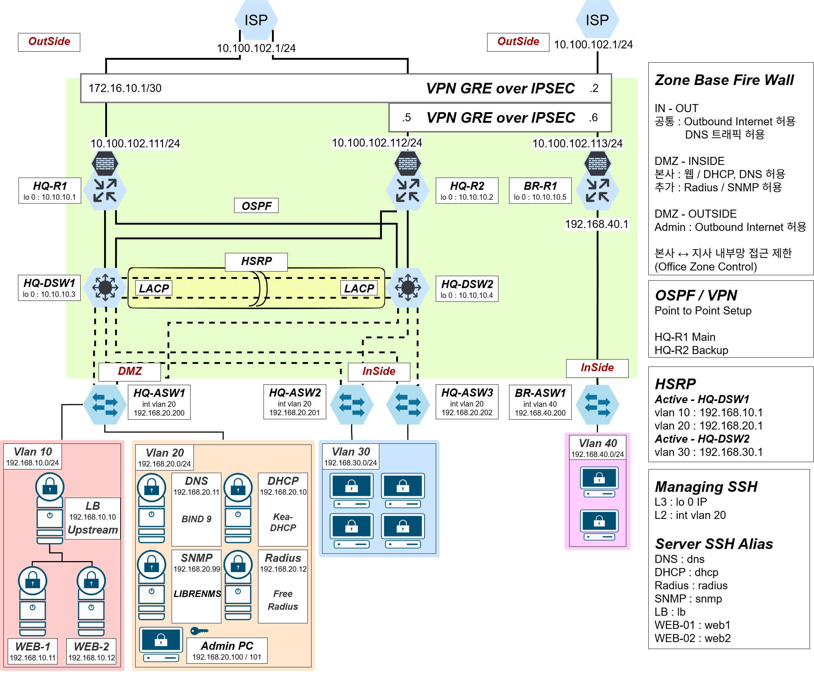

# 🏗 인프라 아키텍처

## 📌 구성 개요

- HQ / Branch 구조
- VPN 연결
- 서버 영역 구성

---

## 🧩 주요 요소

- Router / L3 Switch
- VLAN 기반 네트워크 분리
- WEB / LB / RADIUS 서버

---

## 💡 특징

- Legacy 네트워크 장비 + 최신 서버 혼합 환경
- 중앙 인증 기반 보안 구조

---

## 토폴로지

## 설계 의도

- HQ 이중화 (HSRP + LACP)
- Branch 안정적인 VPN 연결
- 중앙 인증 기반 보안 구조 적용

- HQ / Branch 구조 기반 온프레미스 인프라
- VPN(GRE over IPSEC) 기반 지사 연결
- HSRP + LACP 기반 이중화 구성
- RADIUS 기반 중앙 인증 시스템 적용
